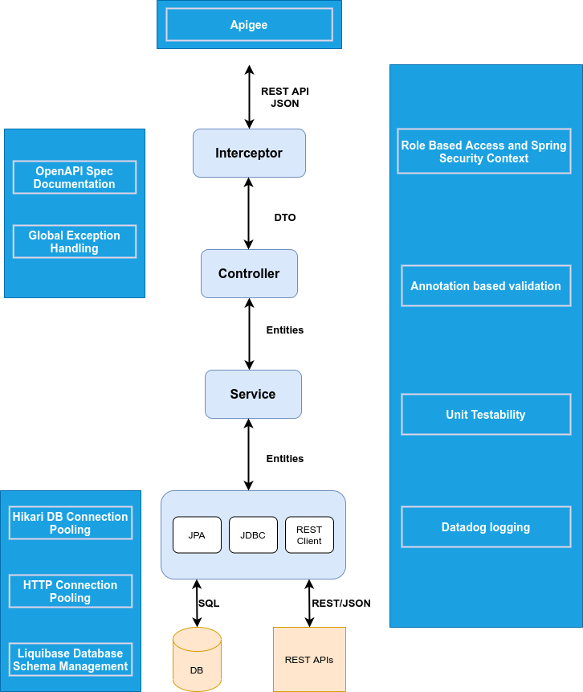
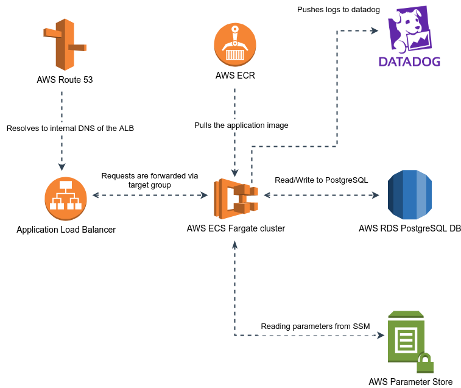
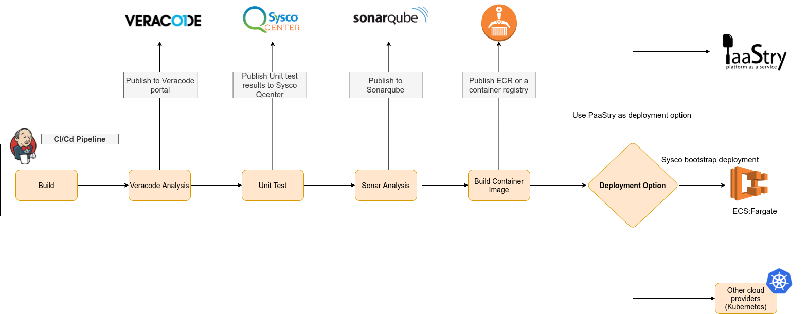

<!-- TABLE OF CONTENTS -->
## Table of Contents

* [About the Project](#about-the-project)
  * [Built With](#built-with)
* [Getting Started](#getting-started)
  * [Prerequisites](#prerequisites)
  * [Installation](#installation)
* [Usage](#usage)
* [Roadmap](#roadmap)
* [Contributing](#contributing)
* [License](#license)
* [Contact](#contact)
* [Acknowledgements](#acknowledgements)


<!-- ABOUT THE PROJECT -->
## About The Project

Tech project serves as a template for micro-service server implementations with extendibility while adhering to necessary standards. The main set
 of features this provides are as follows.
 
- REST API
  * REST API layer with Sprint-web
  * Convenient OpenAPI 3.x spec generation and management for the REST API using [SpringDoc-OpenAPI](https://springdoc.org/)
  * Support for global exception handling with Spring exception handler annotation
  * Parameter validation support with [javax.validation](https://docs.jboss.org/hibernate/validator/4.1/reference/en-US/html/validator-usingvalidator.html#validator-usingvalidator-annotate)

- SQL Persistence Layer
  * [Query DSL](http://www.querydsl.com/) with [Spring JPA](https://docs.spring.io/spring-data/jpa/docs/current/reference/html/#core.extensions.querydsl)
  * Database Connection Pooling with [HikariCP](https://github.com/brettwooldridge/HikariCP)
  * Database Schema Change Management with [Liquibase](https://www.liquibase.org/)

- Logging
  * Async logging with [Log4j2](https://logging.apache.org/log4j/2.x/)
  * JSON Logging
  * Request Traceability
- Datadog Integration
    * Log forwarding for aggregation
    * APM and Distributed Tracing Capabilities
    * Metrics Tracking and Analytics

- CI/CD Pipeline
  * [Jenkins](https://www.jenkins.io/) CI/CD pipeline
  * [SonarQube](https://www.sonarqube.org/) integrated for code quality
  * [Terraform](https://www.terraform.io/) deployment scripts
  * [Apigee](https://syscobt.atlassian.net/wiki/spaces/BSE/pages/1721239308/Sysco+CLI+with+Jenkins) deployment automation

- Unit Testability
  * [Junit 5](https://junit.org/junit5/docs/current/user-guide/) integrated for unit and integration tests
  * [Mockito](https://site.mockito.org/) integrated for method/object mocking
  * [Wiremock](http://wiremock.org/docs/getting-started/) for HTTP layer mocking [TODO]

- Integration of Various Connectors
  * REST Client Connector ([Feign Client](https://syscobt.atlassian.net/wiki/spaces/BSE/pages/3074432349/Feign+Client+Connector+with+OAuth2+Authentication)) to make rest API calls
  * SPEED adaptor integration

- Miscellaneous
  * AWS SSM based secure application configurations using Spring Cloud Config
- Datadog
  * ECS Datadog integration
- Veracode 
  * Veracode integration via CI/CD pipeline stage
- SonarQube
  * SonarQube integration via  CI/CD pipeline stage
- Sysco QCenter integration
  * Sysco QCenter integration via  CI/CD pipeline stage

### Details on Key Features Built into the Framework



[More details on key features](./key-feature-details.md)

### Details on Usage of Terraform for Deployment



[More details on Usage of Terraform for Deployment](./terraform/terraform-overall.md)

### Details on CI/CD Pipeline setup



### Built With

* [Spring Boot](https://docs.spring.io/spring-boot/docs/current/reference/htmlsingle/)
* [Hibernate](https://hibernate.org/orm/)
* [HikariCP](https://github.com/brettwooldridge/HikariCP)
* [Liquibase](https://www.liquibase.org/)
* [Log4j2](https://logging.apache.org/log4j/2.x/)
* [Jenkins](https://www.jenkins.io/)
* [Terraform](https://www.terraform.io/)
* [SpringDoc-OpenAPI](https://springdoc.org/)
* [Junit 5](https://junit.org/junit5/docs/current/user-guide/)
* [Mockito](https://site.mockito.org/)


<!-- GETTING STARTED -->
## Getting Started

To get a local copy up and running follow these simple example steps.

### Prerequisites

* Java 17 or higher
* Docker v20.x or higher - Refer [this](https://docs.docker.com/engine/install/) for installation steps 
* Docker Compose v1.29 or higher - Refer [this](https://docs.docker.com/compose/install/) for installation steps 
* Bash 4.4.20 or higher

### Installation

1. Clone or create a repository out from this template repository - Refer [this](https://docs.github.com/en/repositories/creating-and-managing-repositories/creating-a-repository-from-a-template)

<!-- USAGE EXAMPLES -->
## Usage

### Building and Running Locally

In order to build and run the application locally, the `build.sh` script and `run.sh` script under `${PROJECT_ROOT}/scripts` directory can be
 utilized.
```sh
cd scripts
./build.sh
./run.sh
```

As docker-compose is being used underneath these scripts, it will try to create a docker network at the beginning of the process and in certain
 cases you might get an error as follows if you are connected to the VPN. If you are getting the same, please disconnect from the VPN and try again.
 
```
ERROR: could not find an available, non-overlapping IPv4 address pool among the defaults to assign to the network
```

### Running Test Cases

In order to run the tests, the `test.sh` script under `${PROJECT_ROOT}/scripts` directory can be utilized.
```sh
cd scripts
./test.sh
```

### Cleaning the Build

In order to clean the build, the `clean.sh` script under `${PROJECT_ROOT}/scripts` directory can be utilized.
```sh
cd scripts
./clean.sh
```

As docker and docker-compose is being used in other scripts, in certain cases there could be permission issues to the source files. In that case
 running the clean script will resolve them.

### Running the Deployment Locally

A deployment can be triggered using the `deploy.sh` script under `${PROJECT_ROOT}/scripts` directory.
```sh
cd scripts
./deploy.sh
```

Prior to running this make sure that the following properties are set properly in the deploy.sh script. 

```.env
ENVIRONMENT
AWS_REGION=
PROJECT_NAME_KEBAB_CASE
IMAGE_VERSION
```

In addition, the deploy scripts expects, AWS_ACCESS_KEY_ID, AWS_SECRET_ACCESS_KEY and the AWS_SESSION_TOKEN as well. Please make sure those
 environment variables are set as well. Refer [this blog post](https://aws.amazon.com/blogs/security/aws-single-sign-on-now-enables-command-line-interface-access-for-aws-accounts-using-corporate-credentials/) 
 to learn more on retrieving short-term credentials for CLI use with AWS Single Sign-on.
 
 
 
When it comes to the deployment, most of the parameters are externalized and is read from the above environment variables. However if there are
 other config change requirements, they can be changed in the JSON configurations files at `${PROJECT_ROOT}/terraform/config` directory. Refer [More details on Usage of Terraform for Deployment](./terraform/terraform-overall.md)
### DataDog Integration Setup

To set up datadog with the bt-perso-analytics refer to the confluence page below:

[https://syscobt.atlassian.net/wiki/spaces/A2A/pages/2439088445/How+to+integrate+Datadog+with+API-Blueprint+ECS](https://syscobt.atlassian.net/wiki/spaces/A2A/pages/2439088445/How+to+integrate+Datadog+with+API-Blueprint+ECS)

### Running the Pipeline

In terms of the Jenkins pipeline, one change is required before running it. Under the environments section in the Jenkinsfile, there are a set of
 credentials as follows.
 
 ```
AWS_ACCESS_KEY_ID_PROD = credentials('DIM-Platform-aws-access-key-id-devops-user-management')
AWS_SECRET_ACCESS_KEY_PROD = credentials('DIM-Platform-aws-secret-access-key-devops-user-management')
AWS_ACCESS_KEY_ID_NON_PROD = credentials('DIM-Platform-NonProd-svc_dim_non_prod-access-key-id')
AWS_SECRET_ACCESS_KEY_NON_PROD = credentials('DIM-Platform-NonProd-svc_dim_non_prod-secret-access-key')
```

These are for the AWS access key id and secret key pairs for prod and non-prod environments. Hence prior to running the pipeline, please add your
 AWS access key id and secret keys as `Secret text` in your Jenkins server and please update the credential ids in the Jenkinsfile. You may refer
  [this](https://www.jenkins.io/doc/book/using/using-credentials/) for more details on setting credentials in Jenkins.
  
Once that is done and the pipeline is configured in Jenkins, you can simply use the `Build with parameters` option and run the pipeline. 

### Consumer Tech Stack

Currently, the client tech stack is available in the following branch `release/consumer-stack`  

[Client tech stack](https://github.aws.na.sysco.net/DIM/sysco-bootstrap-java/tree/release/consumer-stack)

#### How to run consumer-clean build

* Navigate to `scripts` folder in project
* Finally ```./run.sh``` can be used to run the application in a local environment

<!-- ROADMAP -->
## Main Page

[Main page](https://syscobt.atlassian.net/wiki/spaces/BSE/pages/2875855409/Sysco+Bootstrap+Java+Server+and+Consumer+Tech+Stacks)


<!-- CONTACT -->
## Contact

Project Link: [https://github.aws.na.sysco.net/DIM/sysco-bootstrap-java](https://github.aws.na.sysco.net/DIM/sysco-bootstrap-java)


<!-- ACKNOWLEDGEMENTS -->
## Acknowledgements
* [Feign Client](https://cloud.spring.io/spring-cloud-netflix/multi/multi_spring-cloud-feign.html)